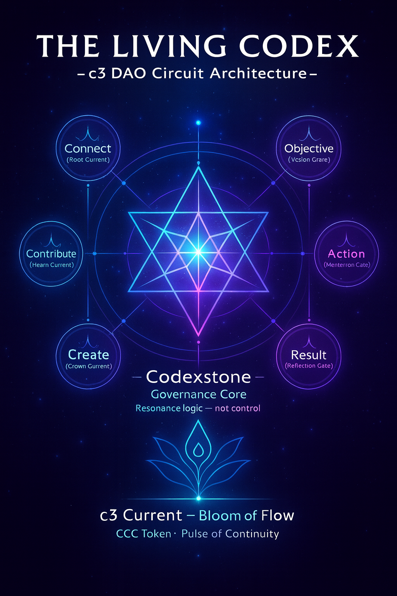

# ✦ c3 Model — Connect · Contribute · Create ✦

  
   
  <em>✦ The Living Circuit of c3 DAO ✦</em>

c3 is a **governance circuit**: a simple loop that keeps culture, resources,
and outcomes coherent.

- **Connect (Root Current)**  
  Invite, onboard, and align. Oracle cards + breath practices.  
  *Signal:* participation, presence, resonance.

- **Contribute (Heart Current)**  
  Give time, art, research, property-in-trust.  
  *Signal:* CCC (access/recognition), issue activity, commits.

- **Create (Crown Current)**  
  Deliver initiatives, events, artifacts, and reports.  
  *Signal:* Results recorded in ledgers; proposals closed.

### Why it works
- **Short feedback loop** → OAR (Objective · Action · Result) on every effort.
- **Access over speculation** → CCC recognizes contribution & opens gates.
- **Myth + method** → Oracle (identity), Codexstone (law), c3 (execution).

See also: [`oar-logic.md`](oar-logic.md)
